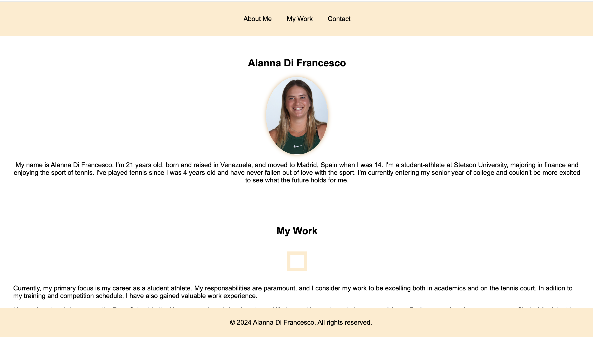
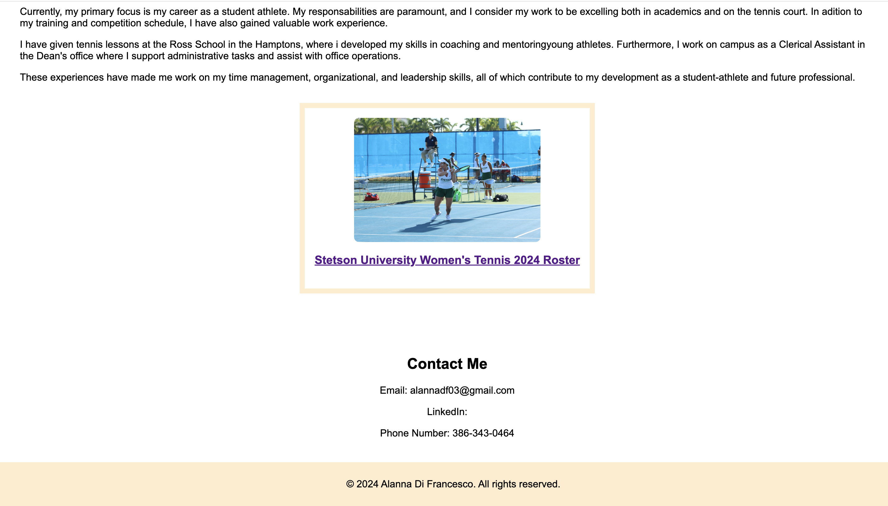

# Challenge 2: Advanced CSS Portfolio

## Description

This project consists in working on building my own portfolio website using HTML and CSS. The main aim is to create a visually attractive and responsive site that shows my skills effectively. This involves organizing the website using clear HTML, styling it with CSS to create a modern appearance. Through this portfolio, I aim to demonstrate my skills and ability to create a professional website without a starter code. 

## Installation

1- We need to create a GitHub repository. Once created, we copy the HTTPS URL and clone it in Visual Studios. 

2- With the repository coned in Visual Studios, we are ready to start coding and create our project. 

3- In Visual Studios we have to create an HTML and CSS file. Also, we should organize the images that we would like to use for our project. 

4- Once the files are ready, we start designing and styling the website the way we want it to look like. 

## Screenshot

## Contributing

1- Create a new repository

2- Push your code to the repository 

3- Make your changes and commit

4- Open a pull request

# Contact

* The URL of deployed application: https://alannadf.github.io/Challenge2/ 

* The URL of the GitHub repository: https://github.com/alannadf/Challenge2.git

